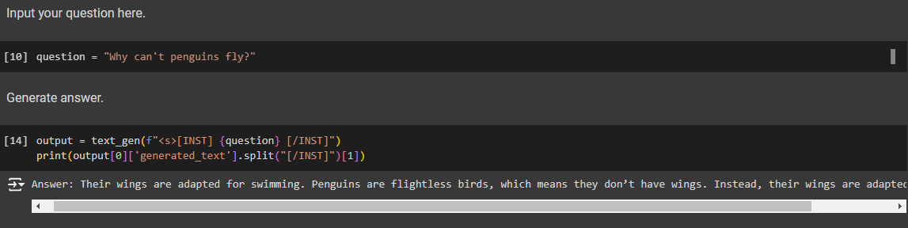

<!-- PROJECT LOGO -->
<br />
<div align="center">
  <h1 align="center">Fine-Tuning Llama 2 Using LoRA <br/> Scientific Questions Answering </h1>
</div>

<!-- ABOUT THE PROJECT -->
## About The Project


This project uses the Llama 2 language model, fine-tuned with the LoRA (Low Rank Adaptation) method and quantization. This approach accelerates the fine-tuning process without losing accuracy. After fine-tuning, the model will be able to answer questions related to science subjects like physics, chemistry, and biology. The goal of this model is to help students better understand and find interest in natural sciences.



- Model use dataset of Scientific Question Answers: [SciQ](https://www.kaggle.com/datasets/thedevastator/sciq-a-dataset-for-science-question-answering)

- Llama 2 Model: [Llama 2 Model](https://huggingface.co/meta-llama/Llama-2-7b-chat-hf)


**Note:** The Llama 2 model is a large language model with 7 billion parameters, requiring a GPU with significant VRAM (approximately 5GB for running the model and 11GB for training). Therefore, it is recommended to use Google Colab (with T4 GPU) or similar platforms to run the model.


## Features
- **Data preprocessing:** Data for training need to be preprocessed to be associated with Llama 2 input format.
- **Quantization:** Convert the floating-point weights into fixed-point integers. By that ways, we can reduce the memory footprint and computational requirements of the model, making it more efficient for deployment on hardware with limited resources.
- **LoRA technique:** LoRA technique helps accelerate the fine-tuning process without losing accuracy.
- **Fine-tune:** Fine-tune Llama 2 with a specific task: Answer scientific question in many subjects like physics, chemistry, and biology.

## Clone the repository
   ```sh
   git clone https://github.com/trungmac07/Llama_2_Scientific_Answers.git
   ```


## Usage
### 1. Data
Data for training is in the folder `data`

### 2. Training

Because of the limitations of devices in training, fine tuning the model takes a long time. To manage this, Google Colab is recommended. 

The training guild will be located in the folder `training_notebook`. Push the notebook to Google Colab, the data should be stored in Google Drive for better usage.

Remember to select T4 GPU or higher in Google Colab.

### 3. Use the model
Push the file notebook `Llama_2_Science_Answer_Run.ipynb` to Google Colab. Change the directory containing the fine-tuned model as you wish and then run the notebook.


## Contact
- Email: mttrung16@gmail.com 


